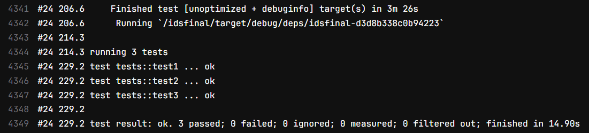
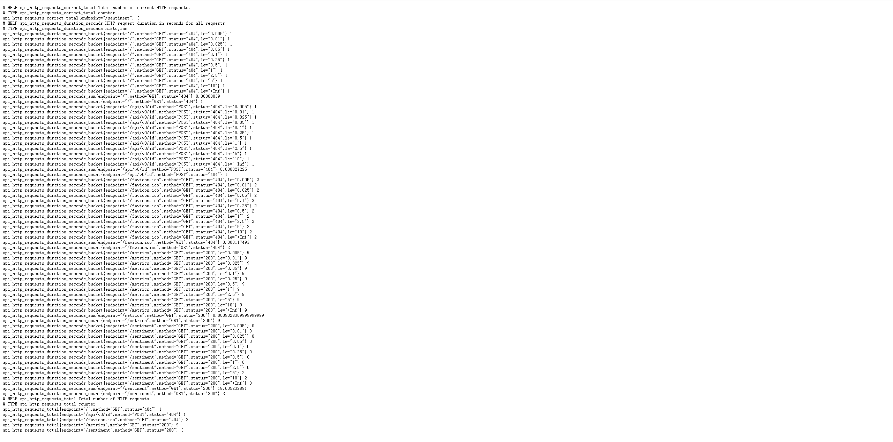
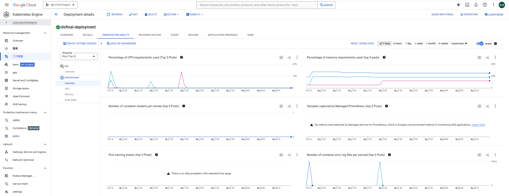
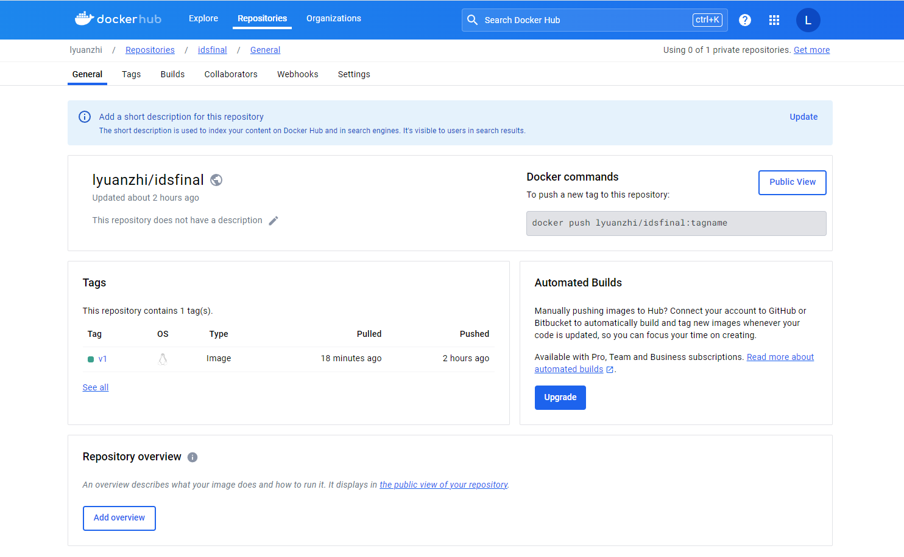

# Sentiment
A Rust-based web service for sentiment analysis. In this project, I operationalized machine learning by serving an open-source model through a web service developed in Rust. This involves monitoring, metrics collection, and containerizing the service for deployment on Kubernetes.

## Tech Stack
1. Rust
2. Docker
3. Kubernetes

## Demo
[http://34.171.102.203/sentiment?text=I%20am%20sad](http://34.171.102.203/sentiment?text=I%20am%20sad)

## Create Rust Web Service
1. cargo new idsfinal
2. Add dependencies
```
[dependencies]
actix-web = "4.5.1"                                         # For Web Service
serde = { version = "1.0", features = ["derive"] }
serde_json = "1.0"
actix-rt = "2.5.0"                                          # For Testing
rust-bert = "0.21.0"                                        # For serving ML Model
actix-web-prom = "0.8.0"                                    # For Metrices Collection
prometheus = { version = "0.13", default-features = false } # For Metrices Collection
```

## Open Source ML Model
[distilbert/distilbert-base-uncased-finetuned-sst-2-english](https://huggingface.co/distilbert/distilbert-base-uncased-finetuned-sst-2-english)\
This model is a fine-tune checkpoint of DistilBERT-base-uncased, fine-tuned on SST-2. It is used to perform English semantic analysis, where the input is a text and the output is either positive or negative.

## Rust Model Serving Using [rust-bert](https://github.com/guillaume-be/rust-bert)

### Install libtorch
1. Download and Unzip\
[https://download.pytorch.org/libtorch/cu118/libtorch-cxx11-abi-shared-with-deps-2.0.0%2Bcu118.zip](https://download.pytorch.org/libtorch/cu118/libtorch-cxx11-abi-shared-with-deps-2.0.0%2Bcu118.zip)\
**Note: rust-bert = "0.21.0" => libtorch = "2.0.0"**
2. Set Environment Variable
```
export LIBTORCH=$HOME/libtorch
export LD_LIBRARY_PATH=${LIBTORCH}/lib:$LD_LIBRARY_PATH
```

### Usage Example
```
let sentiment_classifier = SentimentModel::new(Default::default())?;
let input = [
    "I am happy",
    "I am sad",
];
let output = sentiment_classifier.predict(&input);
```

### Integrate rust-bert and actix-web
1. A endpoint "/sentiment" is created, which calls the sentiment_predict method.
```
HttpServer::new(move || {
    App::new().wrap(prometheus.clone()).app_data(web::Data::new(correct_total.clone())).service(
        web::resource("/sentiment").to(sentiment_predict)
    )
})
```
2. sentiment_predict method.
```
async fn sentiment_predict(correct_counter: web::Data<IntCounterVec>, query: web::Query<TextQuery>) -> impl Responder {
    let input = query.text.clone();
    let prediction_result = web::block(move || {
        let sentiment_classifier = SentimentModel::new(Default::default()).expect("Error creating model");
        let input = [input.as_str()];
        sentiment_classifier.predict(&input)
    })
    .await;

    match prediction_result {
        Ok(output) => {
            let mut response = String::new();
            for sentiment in output {
                response.push_str(&format!("Sentiment: {:?}\n", sentiment.polarity));
            }
            correct_counter.with_label_values(&["/sentiment"]).inc();
            HttpResponse::Ok().content_type("text/plain").body(response)
        },
        Err(_) => {
            HttpResponse::InternalServerError().content_type("text/plain").body(format!("Operation Error!"))
        }
    }
}
```

## Testing
Three test cases are implemented, one for negative sentiment, one for empty input, and one for error.
```
#[cfg(test)]
mod tests {
    use super::*;

    #[actix_rt::test]
    async fn test1() {
        let app = actix_web::test::init_service(App::new().app_data(web::Data::new(
            IntCounterVec::new(opts!("test", "test"), &["endpoint"]).unwrap(),
        )).service(web::resource("/sentiment").to(sentiment_predict))).await;
        let req = actix_web::test::TestRequest::get()
            .uri("/sentiment?text=I%20am%20sad.")
            .to_request();
        let resp = actix_web::test::call_service(&app, req).await;
        let body = actix_web::test::read_body(resp).await;
        assert_eq!(body, web::Bytes::from_static(b"Sentiment: Negative\n"));
    }

    #[actix_rt::test]
    async fn test2() {
        let app = actix_web::test::init_service(App::new().app_data(web::Data::new(
            IntCounterVec::new(opts!("test", "test"), &["endpoint"]).unwrap(),
        )).service(web::resource("/sentiment").to(sentiment_predict))).await;
        let req = actix_web::test::TestRequest::get()
            .uri("/sentiment?text=")
            .to_request();
        let resp = actix_web::test::call_service(&app, req).await;
        let body = actix_web::test::read_body(resp).await;
        assert_eq!(body, web::Bytes::from_static(b"Sentiment: Positive\n"));
    }

    #[actix_rt::test]
    async fn test3() {
        let app = actix_web::test::init_service(App::new().app_data(web::Data::new(
            IntCounterVec::new(opts!("test", "test"), &["endpoint"]).unwrap(),
        )).service(web::resource("/sentiment").to(sentiment_predict))).await;
        let req = actix_web::test::TestRequest::get()
            .uri("/sentiment")
            .to_request();
        let resp = actix_web::test::call_service(&app, req).await;
        let body = actix_web::test::read_body(resp).await;
        assert_eq!(body, web::Bytes::from_static(b"Query deserialize error: missing field `text`"));
    }
}
```
By running ```cargo test```, the output is shown below.


## Monitoring and Metrics

### Using ```actix-web-prom``` and ```prometheus```
1. ```actix-web-prom``` and ```prometheus``` are used for monitoring and metrics collection.
2. We defines three metrics to measure the system's health and performance. They are the total number of correct HTTP requests, the total number of HTTP requests, and the HTTP request duration in seconds for all requests.
3. By visiting the endpoint "/metrics", we can monitor these metrics above.


### GKE (Google Cloud Kubernetes Engine) Monitor


## Dockerization
1. Create ```Dockerfile```
```
# Use an official Rust image
FROM rust:1.75 as builder

RUN apt-get update
RUN apt-get install -y build-essential cmake curl openssl libssl-dev

ARG LIBTORCH_URL=https://download.pytorch.org/libtorch/cu118/libtorch-cxx11-abi-shared-with-deps-2.0.0%2Bcu118.zip

RUN curl -L ${LIBTORCH_URL} -o libtorch.zip && \
    unzip libtorch.zip -d / && \
    rm libtorch.zip

ENV LIBTORCH=/libtorch
ENV LD_LIBRARY_PATH=${LIBTORCH}/lib:$LD_LIBRARY_PATH

# Create a new empty shell project
RUN USER=root cargo new idsfinal
WORKDIR /idsfinal

# Copy the manifests
COPY ./Cargo.lock ./Cargo.lock
COPY ./Cargo.toml ./Cargo.toml

# This is a dummy build to get the dependencies cached
RUN cargo build --release
RUN rm src/*.rs

# Now that the dependencies are built, copy your source code
COPY ./src ./src

# Build for release
RUN rm ./target/release/deps/idsfinal*
RUN cargo build --release

# test
RUN cargo test -v

# Final stage
FROM debian:bookworm-slim
RUN apt-get update
RUN apt-get install -y build-essential cmake curl openssl libssl-dev
COPY --from=builder /idsfinal/target/release/idsfinal .
COPY --from=builder /libtorch/ /libtorch/
ENV LIBTORCH=/libtorch
ENV LD_LIBRARY_PATH=${LIBTORCH}/lib:$LD_LIBRARY_PATH
ENV ROCKET_ADDRESS=0.0.0.0
CMD ["./idsfinal"]
```
2. Build the image
```
docker build -t lyuanzhi/idsfinal:v1 .
```

3. Push to Docker Hub
```
docker login
docker push lyuanzhi/idsfinal:v1
```


## Deploy to Kubernetes
1. GKE (Google Cloud Kubernetes Engine) are used
2. Create ```kubernetes.yaml```
```
apiVersion: apps/v1
kind: Deployment
metadata:
  name: idsfinal-deployment
spec:
  replicas: 3
  selector:
    matchLabels:
      app: idsfinal
  template:
    metadata:
      labels:
        app: idsfinal
    spec:
      containers:
      - name: idsfinal
        image: lyuanzhi/idsfinal:v1
        ports:
        - containerPort: 8080

---
apiVersion: v1
kind: Service
metadata:
  name: idsfinal-service
spec:
  type: LoadBalancer
  ports:
  - port: 80
    targetPort: 8080
  selector:
    app: idsfinal
```
When we set the replicas to 3, the Deployment Controller will ensure that there are always three copies of the application instance in the Kubernetes cluster, which improves scalability and reliability.

3. Install gcloud and its plugins\
[https://cloud.google.com/sdk/docs/install?hl=zh-cn#linux](https://cloud.google.com/sdk/docs/install?hl=zh-cn#linux)
4. Deploy
```
gcloud auth login
gcloud container clusters get-credentials ids721-cluster --zone us-central1 --project aerobic-badge-401819
kubectl apply -f kubernetes.yaml
kubectl rollout restart deployment idsfinal-deployment
```
5. Check the deploy status
```
kubectl get deployments
kubectl get pods -l app=idsfinal
```
6. Get external IP so that we can access
```
kubectl get svc
```
